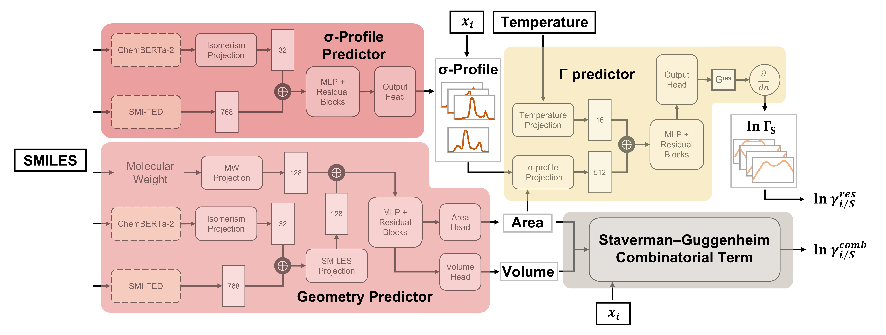

# TeNNet-SAC

TeNNet-SAC (Thermodynamics-Embedded Neural Network for Segment Activity Coefficients) is a machine learning framework designed to predict molecular activity coefficients in multicomponent systems using only molecular SMILES strings, composition, and temperature as input. 



This project provides:

1. **σ-profile prediction model**, including surface area and molecular volume estimation  
2. **Activity coefficient prediction** with two versions:  
   - **Base model**: trained on synthetic data generated from the COSMO-SAC model  
   - **Fine-tuned model**: further optimized using high-quality experimental data  

## Features

- Predicts activity coefficients beyond binary systems
- Requires only SMILES strings, mole fractions, and temperature
- Hard-constraint architecture ensures thermodynamic consistency  
- Modular design: supports use of σ-profiles from QC calculations  
- Robust and generalizable via two-stage training: synthetic COSMO-SAC pretraining followed by experimental fine-tuning, preserving physical consistency

## Installation via PyPI

If you only need to use TeNNet-SAC, install the published package from PyPI.

Create a new environment and install the package:

```bash
conda create -n tsac_env python=3.10 -y
conda activate tsac_env
pip install tennetsac
```
Once installed, import the public API directly:

```python
from tennetsac import profile, binary_lng, multi_lng

# Example 1: Generate σ-profile
s_profile, area, volume = profile("CCO")  # ethanol

# Example 2: Predict activity coefficient for a binary mixture
lng1_list, lng2_list = binary_lng(["CCO", "ClCCCl"], 298.15, [0.0, 0.25, 0.5, 0.75, 1.0])

# Example 3: Predict for multicomponent systems
lng1, lng2, lng3 = multi_lng(["CCO", "ClCCCl", "CCN"], 298.15, [0.3, 0.4])
```
You can fit temperature-dependent NRTL parameters based on TeNNet-SAC predictions.

```python
from tennetsac import fit_nrtl, plot_nrtl_fitting

nrtl_results = fit_nrtl(
    "CCO",
    "ClCCCl",
    alpha=0.3,
    temp_range=[300, 350, 400],  # Kelvin
    x_points=21
)

print(nrtl_results)
```
example output:
```
{
  'parameters': {
      'AIJ': 0.0111,
      'AJI': -1.0671,
      'BIJ': 170.582,
      'BJI': 685.029,
      'Alpha': 0.3
  },
  'fitting_metrics': {
      'RMSE': 0.027034,
      'Max_Abs_Error': 0.134795,
      'Success': True
  },
  'input_info': {
      'Component_i': 'CCO',
      'Component_j': 'ClCCCl',
      'Temp_Range_K': [300, 350, 400]
  }
}
```
To evaluate the fitting quality visually:

```python
plot_nrtl_fitting("CCO", "ClCCCl", nrtl_results)
```
**Note**: The non-randomness parameter (α) must be selected based on the thermodynamic characteristics of the system (default: 0.3).

### Quick Tutorial in Colab
[](https://colab.research.google.com/drive/1plBLQIqTAEglNpi3GqOs5TYYZHp5tLny?usp=sharing)


## Installation from Source

If you want to modify or develop TeNNet-SAC locally, clone the release source on GitHub and install its development extras:

```bash
git clone https://github.com/yueyue2299/TeNNet-SAC.git
cd TeNNet-SAC
pip install -e ".[dev]"
```

Alternatively, create the supplied CPU/GPU-ready conda environment, which installs this local package through pip:

```bash
conda env create -f TeNNet-SAC.yml
conda activate TeNNet-SAC
```

## Usage

You can use the [`examples/TeNNetSAC.ipynb`](./examples/TeNNetSAC.ipynb) notebook locally, or try it directly on Google Colab:

[](https://colab.research.google.com/drive/1Xh1BT-ok73La7AQbjjVSwsRjf6q3JiGx?usp=sharing)

This notebook demonstrates how to:

- Predict **σ-profiles** and molecular geometry from SMILES strings  
- Predict **activity coefficients** for both binary and multicomponent mixtures  
  - You can choose between the **Base model** (trained on COSMO-SAC data) and the **Fine-tuned model** (refined with experimental data)

Importing `tennetsac` does not initialize the models. The packaged models and external embedders initialize on the first prediction call, so that call may download model files when they are not already cached.

For this release, ChemBERTa2 and SMI-TED are revision-pinned external downloads. The future offline ChemBERTa2 location, `src/tennetsac/assets/chemberta2/`, is reserved but intentionally empty. Package versions are derived from Git tags; GitHub is the release source.

## Project Structure

| File/Folder        | Description                                              |
|--------------------|----------------------------------------------------------|
| `TeNNet-SAC.yml`     | Conda environment configuration                          |
| `requirements.txt` | Development install entry point (`-e .[dev]`)            |
| `examples/TeNNetSAC.ipynb` | Example notebook using the public package API     |
| `src/tennetsac`   | Installable package, packaged checkpoints, and utilities |
| `src/tennetsac/assets/chemberta2/` | Reserved, currently empty offline ChemBERTa2 location |
| `README.md`        | Project readme                                           |

## Citation

Yue Yang, Shiang-Tai Lin. *Physics-Embedded Machine Learning Model for Phase Equilibrium Prediction in Multicomponent Systems*. *Journal of Chemical Information and Modeling*, 2025. [DOI: 10.1021/acs.jcim.5c01804](https://doi.org/10.1021/acs.jcim.5c01804)

- [BibTeX (CITATION.bib)](./CITATION.bib)  
- [RIS (CITATION.ris)](./CITATION.ris)

## References

This project builds upon the following foundational models. If you use this project in your research, we encourage you to cite them as well:

- **ChemBERTa-2**  
Ahmad, W.; Simon, E.; Chithrananda, S.; Grand, G.; Ramsundar, B. Chemberta-2: Towards chemical foundation models. arXiv preprint arXiv:2209.01712 2022.
[https://arxiv.org/abs/2209.01712](https://arxiv.org/abs/2209.01712)

- **SMI-TED**  
Soares, E.; Shirasuna, V.; Brazil, E. V.; Cerqueira, R.; Zubarev, D.; Schmidt, K. A large encoder-decoder family of foundation models for chemical language. arXiv preprint arXiv:2407.20267 2024.
[https://arxiv.org/abs/2407.20267](https://arxiv.org/abs/2407.20267)

### External Code Acknowledgment

The packaged `src/tennetsac/smi_ted_light/` support code is adapted from the [SMI-TED](https://github.com/IBM/materials/tree/main/models/smi_ted) repository by Soares et al., with only minimal modifications. The SMI-TED model weights themselves are revision-pinned external downloads. Full credit goes to the original authors.

## License

MIT License. See [LICENSE](LICENSE) for details.

---

Maintained by **Yue Yang** ([@yueyue2299](https://github.com/yueyue2299)).

COMET, Department of Chemical Engineering, National Taiwan University  
